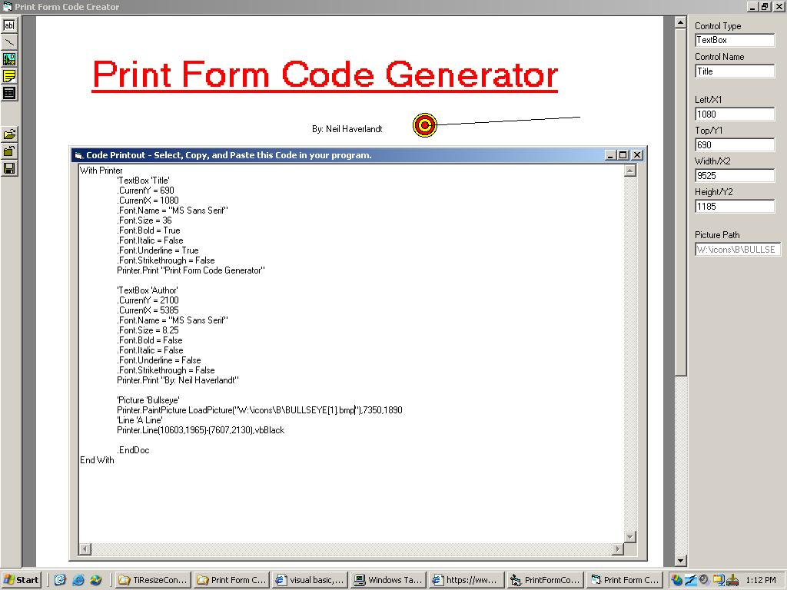



## Print Form Code Generator

### Description

Updated: Metric Grid Scale and Landscape capable.

If you hate writing VB code to create printed forms, give this a try. Print Form Code Generator lets you create forms by dropping text boxes, pictures and line on a form and generate the VB print code to paste in your program. This is the first version and it can only get better. Feedback is welcome.

To move lines,

click to move a point

shift + click to move the line

ctrl + click to move point left and right only

alt + click to move point up and down only

shift+ctrl+click moves other point's top position to clicked point's top position

shift+alt+click moves other point's left position to clicked point's left position

New Version: Select paper size, and line ghosts gone!!
 
### More Info
 
To move lines,

click to move a point

shift + click to move the line

ctrl + click to move point left and right only

alt + click to move point up and down only

shift+ctrl+click moves other point's top position to clicked point's top position

shift+alt+click moves other point's left position to clicked point's left position

             |
---                |---
**Submitted On**   |2003-06-22 10:02:46
**By**             |[Neil Haverlandt](https://github.com/Planet-Source-Code/PSCIndex/blob/master/ByAuthor/neil-haverlandt.md)
**Level**          |Advanced
**User Rating**    |4.8 (19 globes from 4 users)
**Compatibility**  |VB 6\.0
**Category**       |[Complete Applications](https://github.com/Planet-Source-Code/PSCIndex/blob/master/ByCategory/complete-applications__1-27.md)
**World**          |[Visual Basic](https://github.com/Planet-Source-Code/PSCIndex/blob/master/ByWorld/visual-basic.md)
**Archive File**   |[Print\_Form1607746302003\.zip](https://github.com/Planet-Source-Code/neil-haverlandt-print-form-code-generator__1-46132/archive/master.zip)

